# Decisões de modelagem

Resumo do que decidi no banco durante o CP2 e por quê, para o README e para a apresentação. Os detalhes e a conferência de cada item estão em [revisao-schema.md](revisao-schema.md) e [decisao-saldo-atual.md](decisao-saldo-atual.md).

## O modelo

```mermaid
erDiagram
    CONTA ||--o{ TRANSACAO : "tem (CASCADE)"
    CONTA ||--o{ ALERTA : "tem (CASCADE)"
    CATEGORIA |o--o{ TRANSACAO : "classifica (SET NULL)"

    CONTA {
        int id PK
        string nome
        numeric saldo_atual "12,2, denormalizado"
        datetime criado_em
    }
    CATEGORIA {
        int id PK
        string nome UK
    }
    TRANSACAO {
        int id PK
        numeric valor "12,2, valor > 0"
        string tipo "entrada ou saida"
        int categoria_id FK "pode ser NULL"
        int conta_id FK
        datetime data
        text descricao
    }
    ALERTA {
        int id PK
        int conta_id FK
        text mensagem
        text recomendacao "gerada pela IA"
        datetime data
        string nivel_risco "baixo, medio ou alto"
    }
```

Quatro tabelas, uma por entidade do enunciado, sem tabela de ligação: todos os relacionamentos são 1 para N. Está normalizado até a terceira forma. Nenhum atributo depende de outro que não seja a chave, e a única duplicação de dado é a do `saldo_atual`, que é proposital (ver adiante).

## Decisões e justificativas

**Dinheiro em `Numeric(12, 2)`.** `float` acumula erro de arredondamento em soma de centavos. `Numeric` guarda o valor exato e comporta até 9.999.999.999,99, folga de sobra para um pequeno negócio. O `recalcular_saldo` ainda soma em `float` no Python antes de gravar; com o volume atual não faz diferença, e trocar por `Decimal` ou por um `SUM` no banco está na lista de melhorias.

**`valor` sempre positivo, sinal vindo do `tipo`.** A transação guarda `valor > 0` e `tipo` em `entrada` ou `saida`. Guardar o sinal no valor deixaria duas fontes para a mesma informação e permitiria uma saída positiva ou uma entrada negativa. As duas regras são `CHECK` no banco, então valem mesmo para quem escreve fora da API.

**`CHECK` no lugar de tabela de domínio para `tipo` e `nivel_risco`.** São conjuntos pequenos e fixos (2 e 3 valores). Uma tabela extra exigiria join em toda leitura sem nada a ganhar. Se um dia o conjunto crescer ou precisar de rótulo próprio, aí vale virar tabela.

**`saldo_atual` denormalizado em `conta`.** É a única informação duplicada do schema. É a leitura mais comum do sistema e a escrita de transação é rara, então guardo o total em vez de somar o histórico a cada consulta. Toda escrita em transação recalcula o valor do zero (não incrementa), o que impede que uma divergência se acumule. O `GET /contas/:id/saldo` recalcula de novo na leitura, para pegar transação com data futura que já venceu. O saldo projetado não é guardado, é calculado a cada chamada. Justificativa completa, alternativas descartadas e limitação em [decisao-saldo-atual.md](decisao-saldo-atual.md).

**`alerta` como retrato do momento.** `nivel_risco` poderia ser calculado a partir do saldo projetado, mas o projetado muda depois que o alerta é criado. O alerta registra o nível daquele instante, então guardar é o comportamento certo, não duplicação.

**Categoria opcional na transação.** `categoria_id` aceita `NULL`, e isso tem função no negócio: `NULL` é o gatilho que faz o backend chamar a IA para categorizar. Ao apagar uma categoria, a chave estrangeira usa `ON DELETE SET NULL`, e as transações voltam a ficar sem categoria em vez de sumirem.

**`ON DELETE CASCADE` de conta para transação e alerta.** Um extrato sem a conta a que pertence não tem uso, então apagar a conta leva o histórico junto. Hoje não existe `DELETE /contas`, então a cascata não é exercitada pela API. Se a rota for criada, a decisão precisa ser confirmada na tela antes de apagar.

**Índices.** A migration `94bd0c73981a` trocou e acrescentou índices para as consultas que o dashboard faz:

| Índice | Consulta que atende |
|---|---|
| `idx_transacao_conta_data (conta_id, data)` | Transações de uma conta ordenadas por data. Substitui `idx_transacao_conta_id`, que era prefixo dele |
| `idx_transacao_categoria_id` | Filtro por categoria e o `SET NULL` ao apagar categoria (o Postgres não indexa chave estrangeira sozinho) |
| `idx_alerta_conta_data (conta_id, data)` | Alertas recentes de uma conta |
| `idx_transacao_data` (já existia) | Período de todas as contas juntas |

`transacao.tipo` ficou sem índice porque só tem dois valores. Conferi com `EXPLAIN` num Postgres 16 com 200 mil transações: conta com ordenação por data e `LIMIT 50` usa o composto e dispensa o sort; busca por categoria usa `idx_transacao_categoria_id`. Duas ressalvas medidas: numa faixa curta de datas o planejador preferiu `idx_transacao_data`, e o total por categoria sobre a tabela inteira faz `Seq Scan`, porque agregar tudo lê tudo. O índice não ajuda esse caso.

**Migrations com Flask-Migrate.** O schema muda só por migration versionada (`0c68856f9520` cria as tabelas, `94bd0c73981a` mexe nos índices). Testei a cadeia inteira num Postgres limpo, o `downgrade` e o `upgrade` de volta, e `flask db check` respondeu que model e banco batem. Apliquei no banco do Render em 23/09.

## Limitações conhecidas

Ficam registradas em vez de escondidas. Nenhuma quebra o funcionamento atual.

- **Nome de categoria diferencia maiúsculas.** "Vendas" e "vendas" entram como duas categorias. A correção é um índice único sobre `lower(nome)` mais a mesma normalização na rota, e antes dela é preciso checar duplicatas já existentes. Não entrou no CP2.
- **Alertas repetidos.** Toda escrita de transação com projeção negativa cria um alerta novo, sem checar se já existe um igual. Precisa de uma regra (um alerta aberto por conta e nível, ou uma coluna de status). A lógica é do Charles, então falta combinar com ele.
- **Valor projetado só no texto do alerta.** `alerta.mensagem` guarda o número dentro da frase. Para ordenar ou somar por ele, seria preciso uma coluna numérica.
- **Dois commits em `_avaliar_risco`.** Se o segundo falhar, a transação fica gravada com o saldo defasado, que se corrige na próxima escrita. Duas requisições simultâneas na mesma conta também podem sobrescrever o saldo uma da outra.
- **`nivel_risco` aceita `NULL`.** Na prática a rota sempre preenche. Pode virar `NOT NULL`.
- **Testes só em SQLite em memória.** A cadeia de migrations e os índices foram validados em Postgres à mão. Se o CI passar a rodar em Postgres, os testes precisam de um `drop_all()` entre um caso e outro.

## Para explicar na apresentação

- Por que o banco tem quatro tabelas: uma por entidade, todos os relacionamentos 1 para N, sem duplicação além do saldo.
- Por que `saldo_atual` está duplicado: leitura muito mais frequente que escrita, recálculo completo a cada escrita, e o endpoint recalcula na leitura.
- Por que `valor` é positivo e o sinal vem do `tipo`: uma só fonte para a informação, garantida por `CHECK`.
- Por que `categoria_id` pode ser nulo: o `NULL` dispara a categorização por IA.
- O que os índices resolvem e onde não ajudam (o `EXPLAIN` acima).
- O que ficou de fora e por quê (seção anterior).
